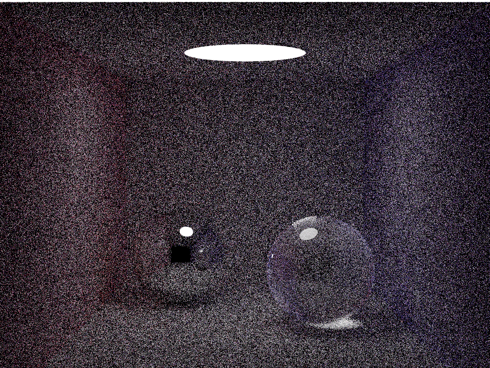

# smallpt4j

Transport of smallpt for Java
http://www.kevinbeason.com/smallpt/

samples=25000

|                 |||||||
|:---|:---|:---|:---|:---|:---|:---|
|                 |SPP 8                |SPP 40                |SPP 200                 |SPP 1000                  |SPP 5000                  |SPP 25000                   |
|i7 7820X/8thrs   |3 sec                |7 sec                 |27 sec                  |130 sec                   |10 min                    |55 min                      |
|Core 2 Quad/4thrs|13 sec               |63 sec                |5 min                   |25 min                    |124 min                   |10.3 hrs                    |

This software is released under the MIT License.
[LICENSE.txt](LICENSE.txt)

This is based on the smallpt( http://www.kevinbeason.com/smallpt/ )
that is released under the MIT License.
[smallpt_LICENSE.txt](smallpt_LICENSE.txt)

