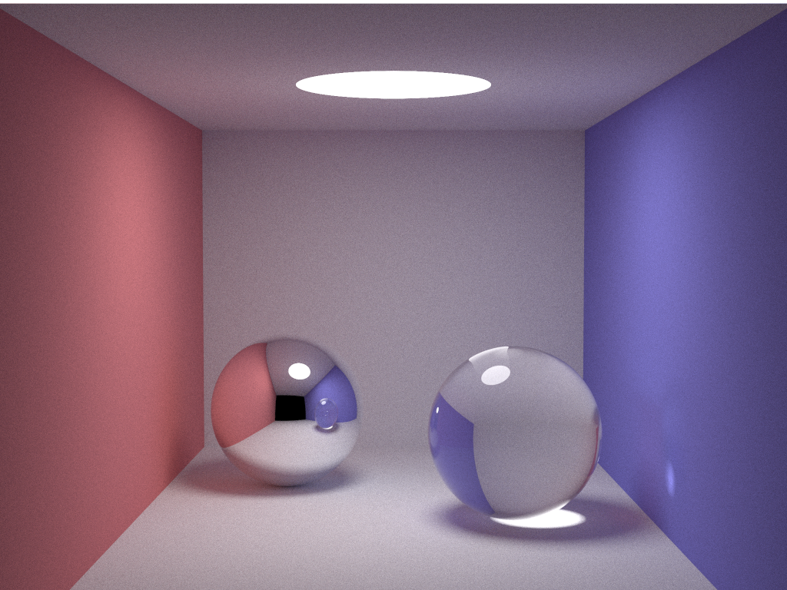
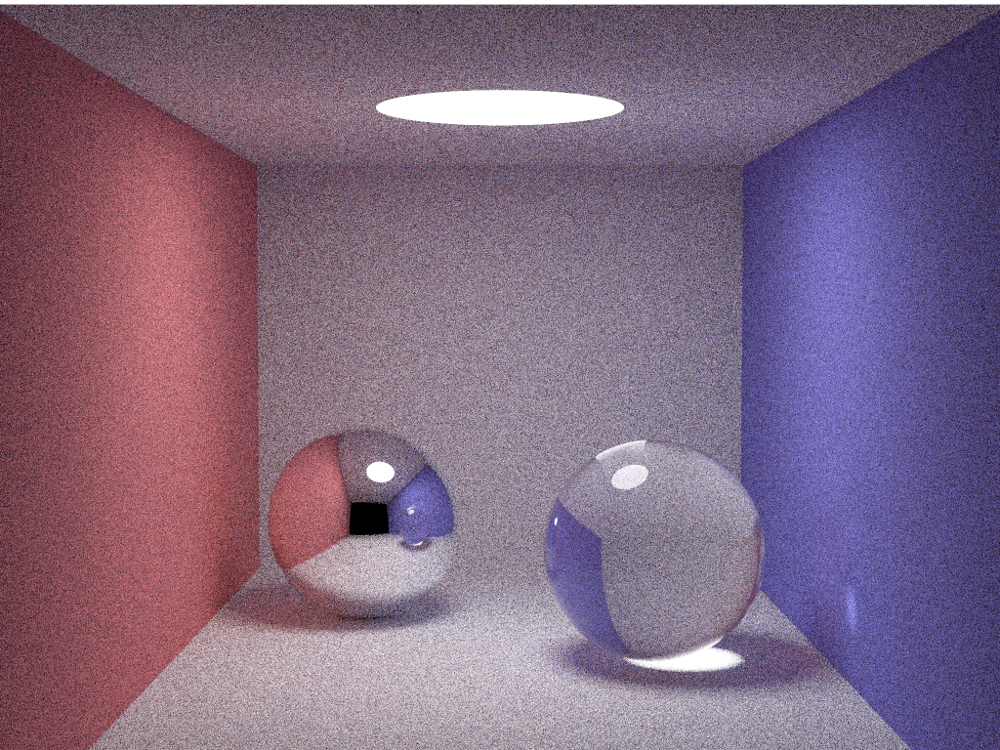

# smallpt4s

Scala porting of https://github.com/kishida/smallpt4j ,
which original is http://www.kevinbeason.com/smallpt/

## Generated Images

- samples:4000 (Java)

- samples:200 (Java)

- samples:4000 (Scala)

samples=200 (Scala)

## License

MIT License.  See https://github.com/kmizu/smallpt4s/LICENSE
